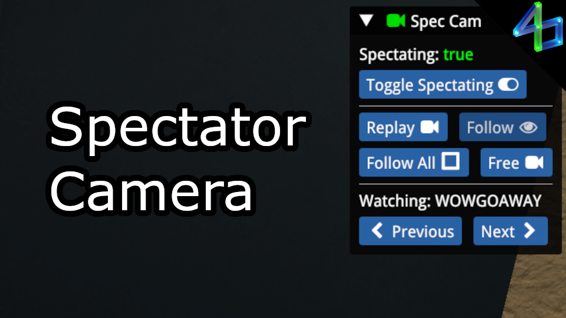

# Spectator Camera

I find it a bit annoying to change between spectator cameras, so I wrote a plugin to make it a bit easier. Eventually you will be able to set a default camera, so if you hate getting the "Follow All" view in Cup of the Day like I do, you'll be able to change it to never show that again! I'm finding it a bit tricky to detect when we're spectating in COTD, but hopefully I will figure that out before too long and update this plugin with that and with more customization.

